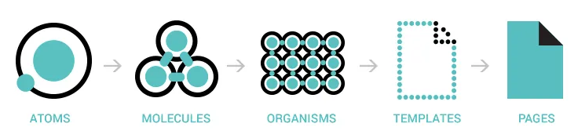

# Gaming Campus Module 1 LUA BattleTank

--------

Pour la réalisation de ce jeu, j'utilise un système de composants (Component)

Pour la définition des composants j'ai utilisé l'atomic design adapté aux composants de jeu video.

L'idée était donc de développer des composants (atomes) (images, text, sons, etc) qui peuvent être combinés pour créer
des composants (molécules) plus complexes (bouton, menu, etc) pour ensuite les combiner a nouveau dans des elements plus
complexe du jeu (organismes) (joueur, enemi, interface, etc) pour finalement les combiner dans des scenes (templates,
pages)

# Les bases de l'architecture

Les classes de bases de l'architecture sont 5 classes qui gèrent les interractions entre love et le framework du jeu

[Voir une description plus détaillée](./docs/architecture.md)

--------

# Les composants du framework

## Les atomes

Les atomes sont les composants de base, ils ne contiennent pas d'autres composants

[Voir une description plus détaillée](./docs/atoms.md)

--------

## Les molécules

Le molécules utilisent les atomes pour créer des composants plus complexes

[Voir une description plus détaillée](./docs/molecules.md)

--------

## Les organismes du jeu

Les organismes sont des composants plus complexes qui contiennent des molécules et des atomes

[Voir une description plus détaillée](./docs/organisms.md)

--------

## Les templates/scenes du jeu

Les templates/scenes sont des composants plus complexes qui contiennent des organismes, des molécules et des atomes

[Voir une description plus détaillée](./docs/templates.md)

--------

## Les classes utilitaires

Les classes utilitaires sont des classes qui apportent des fonctionnalités partagées par les composants du framework

[Voir une description plus détaillée](./docs/utils.md)

