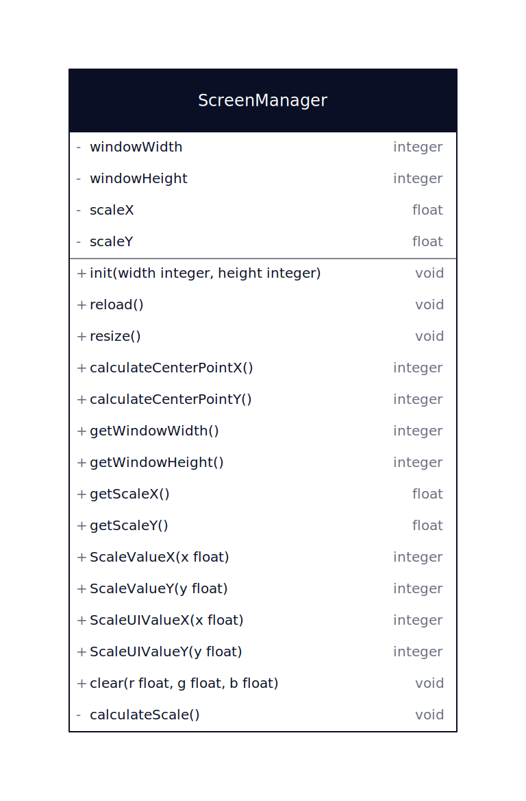

## Gaming Campus Module 1 LUA BattleTank

--------

### models/configuration/Configuration.lua
La classe configuration enregistre dans un fichier les éléments de configuration de l'utilisateur (full-screen, vsync, volume de la musique, volume des effets sonores, niveau de difficulté)

--------

### models/screen/ScreenManager.lua
ScreenManager permet de gérer les changements de résolution, lors de son initialisation l'objet ScreenManager est initialisé avec la résolution de développement.
Ensuite la classe permet d'obtenir le ratio à appliquer à chaque composant du jeu afin de s'adapter à la résolution actuelle.

--------

### models/scenes/ScenesManager.lua
ScenesManager gère la collection de scene actuellement actives dans le jeu, il permet également d'appeler automatiquement les méthodes load, update, draw, unload de chaque scene.

### models/scenes/Scene.lua
La classe Scene est une classe abstraite dont chaque scene hérite, les scenes contiennent une collection de composants, c'est la scene qui est en charge d'appeler les méthode load, update, draw, unload de chaque composant qu'elle contient.

### models/scenes/Component.lua
La classe Component est une classe abstraite dont chaque composant hérite, les composants contiennent une collection de sous-composants, c'est le composant qui est en charge d'appeler les méthodes load, update, draw, unload de chaque sous-compopsant qu'il contient.

--------

### models/audio/SoundEffect.lua
Le composant SoundEffect permet de lire un fichier audio, il possède des méthodes play, stop, pause

### models/images/Image.lua
Le composant Image permet d'afficher une image, il possède des propriétés permettant de changer l'orientation, la taille

### models/images/Parallax.lua
Le composant Parallax permet d'afficher une image en appliquant un effet de mouvement sur l'axe X

### models/images/SpriteSheetImage.lua
Le composant SpriteSheetImage permet d'afficher un sprite sheet animé en définissant le nombre de colonnes, de lignes, la vitesse de lecture

### models/texts/BitmapText.lua
Le composant BitmapText permet d'afficher un texte en utilisant une bitmap font

### models/texts/Text.lua
Le composant Text permet d'afficher un texte en utilisant la font standard de love

--------

### models/ui/Button.lua
Le composant Button permet d'afficher un bouton avec l'effet au survol, cliqué, il permet également d'executer un callback lors du click

### models/ui/CheckBox.lua
Le composant CheckBox permet d'afficher une checkbox

### models/ui/Frame.lua
Le composant Frame permet d'afficher une fenetre en utilisant une texture compatible nine-patch

### models/ui/Slider.lua
Le composant Slider permet d'afficher un slider qui permet à l'utilisateur de sélectionner une valeur comprise entre 0 et 1

### models/ui/SliderButton.lua
Le composant SliderButton est utilisé dans le composant Slider afin d'afficher les boutons + et - qui permettent de modifier la valeur de ce-dernier.

--------

### models/tools/Fps.lua
Le composant Fps permet d'afficher les FPS actuels à l'écran