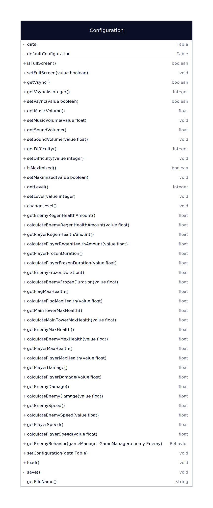
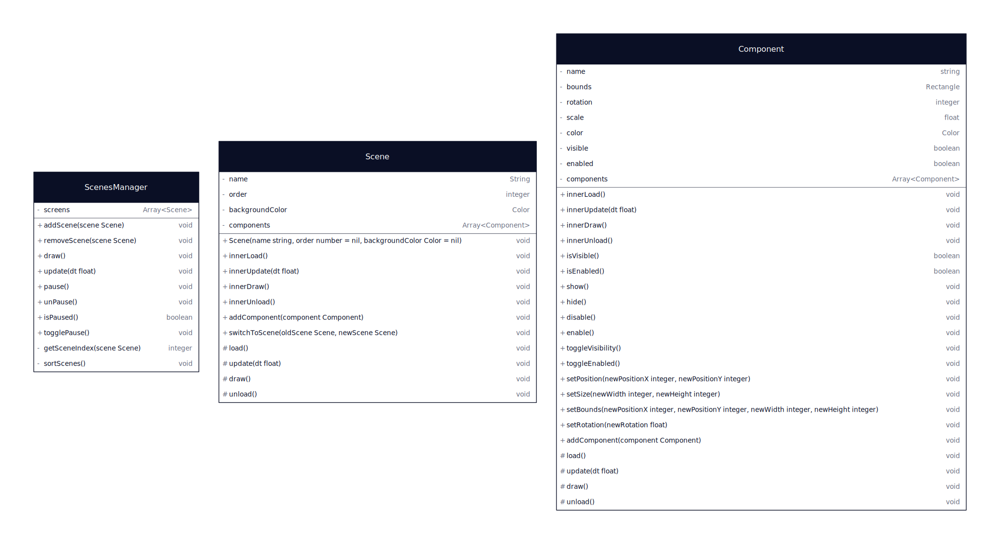

# Les bases de l'architecture

Les classes de bases de l'architecture sont 5 classes qui gèrent les interractions entre love et le framework du jeu

### framework/configuration/Configuration.lua

La classe configuration enregistre dans un fichier les éléments de configuration de l'utilisateur (full-screen, vsync,
volume de la musique, volume des effets sonores, niveau de difficulté, retourne également les différents parametres du
jeu en fonction de la difficulté)

### framework/screen/ScreenManager.lua

ScreenManager permet de gérer les changements de résolution, lors de son initialisation l'objet ScreenManager est
initialisé avec la résolution de développement.
Ensuite la classe permet d'obtenir le ratio à appliquer à chaque composant du jeu afin de s'adapter à la résolution
actuelle.

## Le coeur de l'architecture en composants

### framework/scenes/ScenesManager.lua

ScenesManager gère la collection de scene actuellement actives dans le jeu, il permet également d'appeler
automatiquement les méthodes load, update, draw, unload de chaque scene.

### framework/scenes/Scene.lua

La classe Scene est une classe abstraite dont chaque scene hérite, les scenes contiennent une collection de composants,
c'est la scene qui est en charge d'appeler les méthode load, update, draw, unload de chaque composant qu'elle contient.

### framework/scenes/Component.lua

La classe Component est une classe abstraite dont chaque composant hérite, les composants contiennent une collection de
sous-composants, c'est le composant qui est en charge d'appeler les méthodes load, update, draw, unload de chaque
sous-compopsant qu'il contient.

