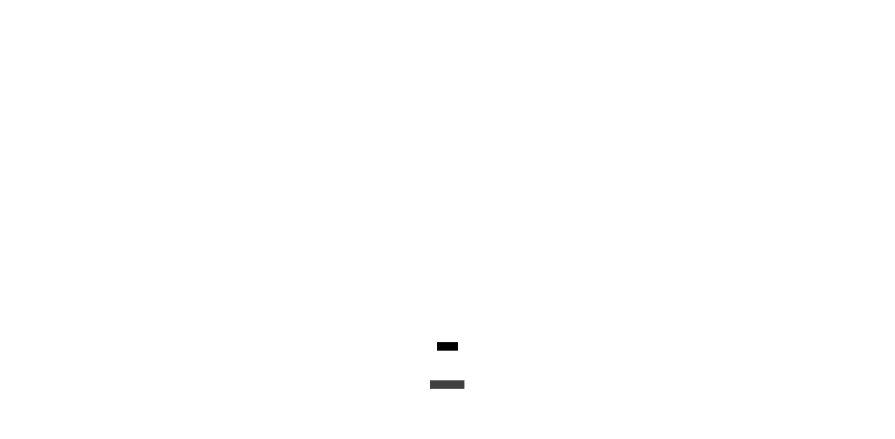
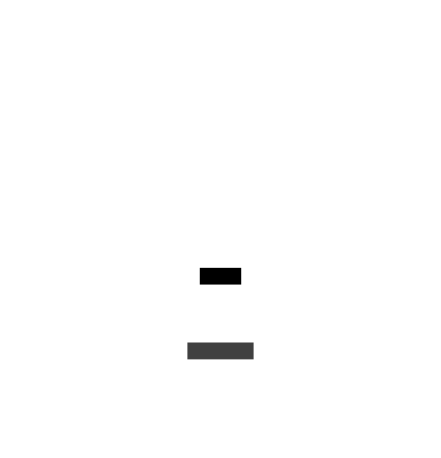

# Les atomes

Les atomes sont les composants de base, ils ne contiennent pas d'autres composants

### framework/audio/SoundEffect.lua

Le composant SoundEffect permet de lire un fichier audio, il possède des méthodes play, stop, pause

### framework/images/Image.lua

Le composant Image permet d'afficher une image, il possède des propriétés permettant de changer l'orientation, la taille

### framework/images/Parallax.lua

Le composant Parallax permet d'afficher une image en appliquant un effet de mouvement sur l'axe X

### framework/images/SpriteSheetImage.lua

Le composant SpriteSheetImage permet d'afficher un sprite sheet animé en définissant le nombre de colonnes, de lignes,
la vitesse de lecture

### framework/texts/BitmapText.lua

Le composant BitmapText permet d'afficher un texte en utilisant une bitmap font

### framework/texts/Text.lua

Le composant Text permet d'afficher un texte en utilisant la font standard de love

### framework/ui/DialogBackground.lua

Le composant DialogBackground permet d'afficher un fond semi-transparent pour les dialogues et les menus

### framework/ui/Frame.lua

Le composant Frame permet d'afficher une fenetre en utilisant une texture compatible nine-patch

### framework/tools/Delay.lua

Le composant Delay permet de déclencher un callback après un certain délai

