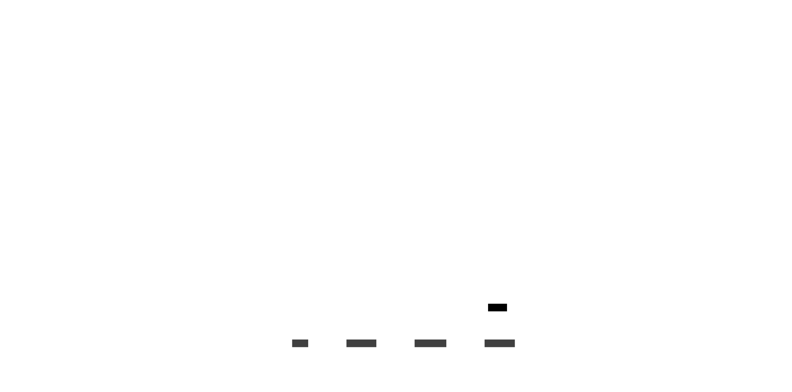
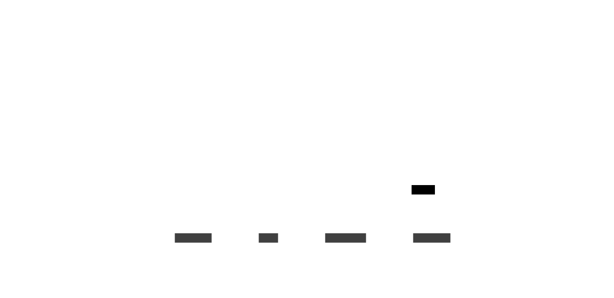
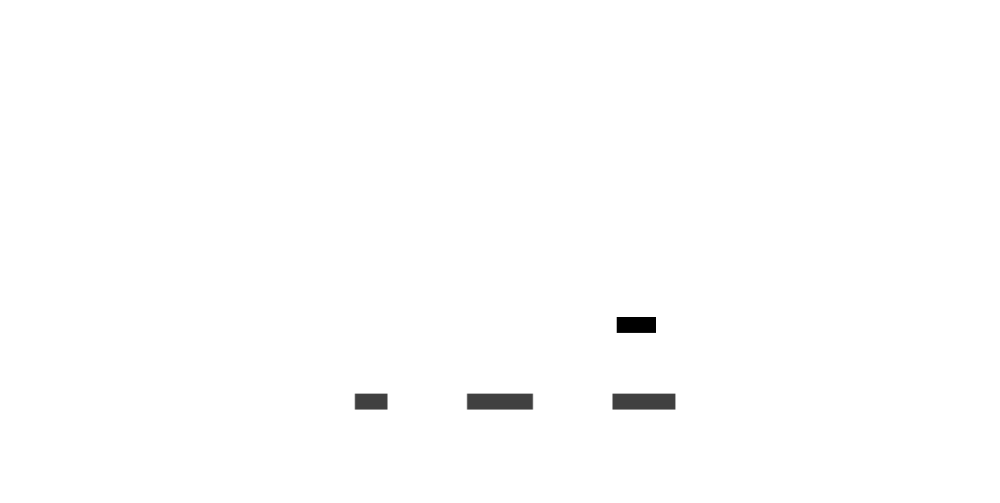

# Les molécules

Le molécules utilisent les atomes pour créer des composants plus complexes

### framework/ui/Button.lua

Le composant Button permet d'afficher un bouton avec l'effet au survol, cliqué, il permet également d'executer un
callback lors du click

### framework/ui/CheckBox.lua

Le composant CheckBox permet d'afficher une checkbox

### framework/ui/MenuFrame.lua

Le composant MenuFrame permet d'afficher une fenetre qui arrive depuis la droite en utilisant une texture compatible
nine-patch

### framework/ui/LeftMenuFrame.lua

Le composant LeftMenuFrame permet d'afficher une fenetre qui arrive depuis la gauche en utilisant une texture compatible
nine-patch

### framework/ui/Slider.lua

Le composant Slider permet d'afficher un slider qui permet à l'utilisateur de sélectionner une valeur comprise entre 0
et 1

### framework/ui/SliderButton.lua

Le composant SliderButton est utilisé dans le composant Slider afin d'afficher les boutons + et - qui permettent de
modifier la valeur de ce-dernier.

