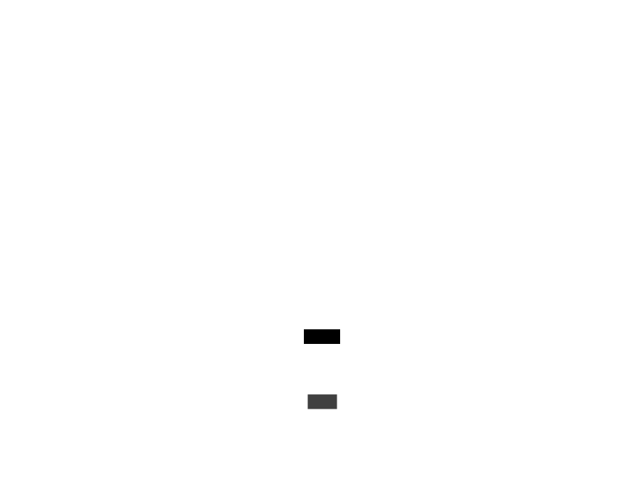
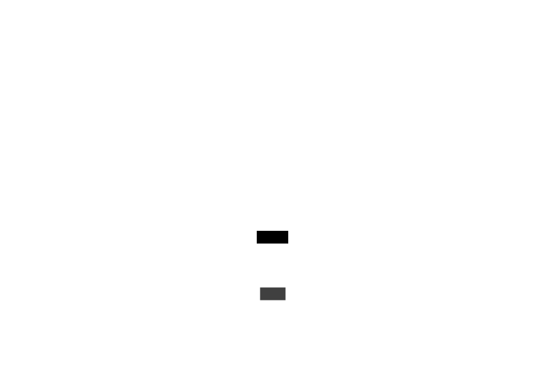

# Les organismes de la scene : Niveau du jeu - Element de jeu - Entités - Comportement

Elements spécifiques a l'attitude des enemis dans le jeu.

### models/gameLevel/entities/behaviors/Behavior.lua

Le composant Behavior est l'élément de base pour le comportement des entitiés.

### models/gameLevel/entities/behaviors/EasyBehavior.lua

Le composant EasyBehavior est l'élément de comportement des entitiés niveau facile.

### models/gameLevel/entities/behaviors/MediumBehavior.lua

Le composant MediumBehavior est l'élément de comportement des entitiés niveau moyen.

### models/gameLevel/entities/behaviors/HardBehavior.lua

Le composant MediumBehavior est l'élément de comportement des entitiés niveau difficle.

### models/gameLevel/entities/behaviors/orders/Order.lua

Le composant Order est l'élément de base des ordres des entitiés.

### models/gameLevel/entities/behaviors/orders/MoveOrder.lua

Le composant MoveOrder est l'élément qui gère le déplacement d'une entités.

### models/gameLevel/entities/behaviors/orders/AttackOrder.lua

Le composant AttackOrder est l'élément qui gère l'attaque d'une entités.

### models/gameLevel/entities/behaviors/orders/DefendOrder.lua

Le composant DefendOrder est l'élément qui gère le passage en défence d'une entités.

