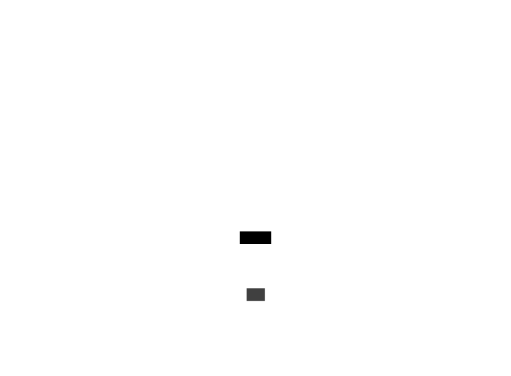
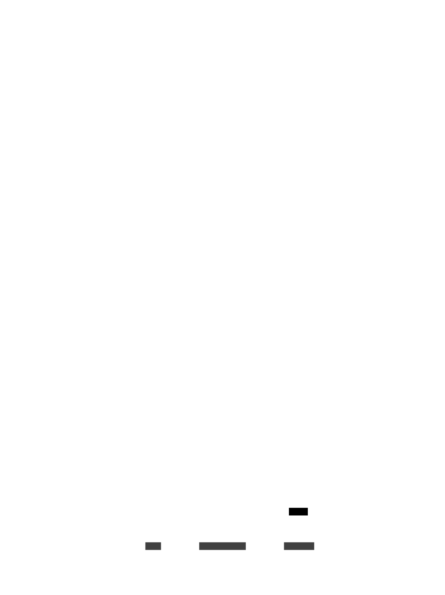

# Les organismes de la scene : Niveau du jeu - Element de jeu - Entités

Les organismes de la scene Niveau du jeu element de jeu entités sont les éléments qui gère les entités du jeu.

J'ai placé les élements spécifiques a l'attitude des enemis dans ce document :

- [Attitude des enemis](./organisms-gamelevel-game-entities-behavior.md)

### models/gameLevel/entities/Entity.lua

Le composant Entity est l'élément de base des entités du jeu.

### models/gameLevel/entities/Flag.lua

Le composant Flag est l'élément qui represente les tours a capturer du jeu.

### models/gameLevel/entities/MainTower.lua

Le composant MainTower est l'élément qui represente les tours principales des joueurs.

### models/gameLevel/entities/Unit.lua

Le composant Unit est l'élément qui represente les unités (tank) du joueur ou des enemis.

### models/gameLevel/entities/Enemy.lua

Le composant Enemy est l'élément qui represente les unités (tank) de l'enemi.

### models/gameLevel/entities/Player.lua

Le composant Enemy est l'élément qui represente les unités (tank) du joueur.

### models/gameLevel/entities/UnitMissible.lua

Le composant UnitMissible est l'élément qui represente les missiles lancés par les entitiés.

### models/gameLevel/entities/HealthBar.lua

Le composant HealthBar est l'élément qui represente les barres de vie des entitiés.

