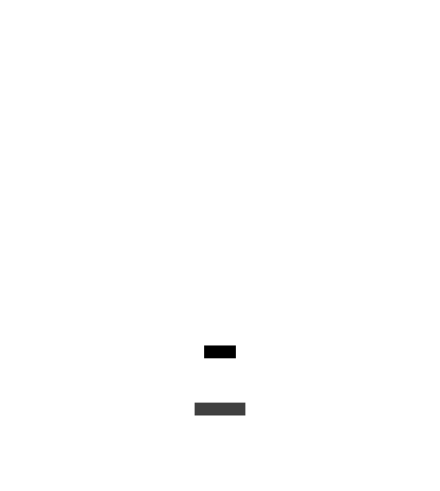
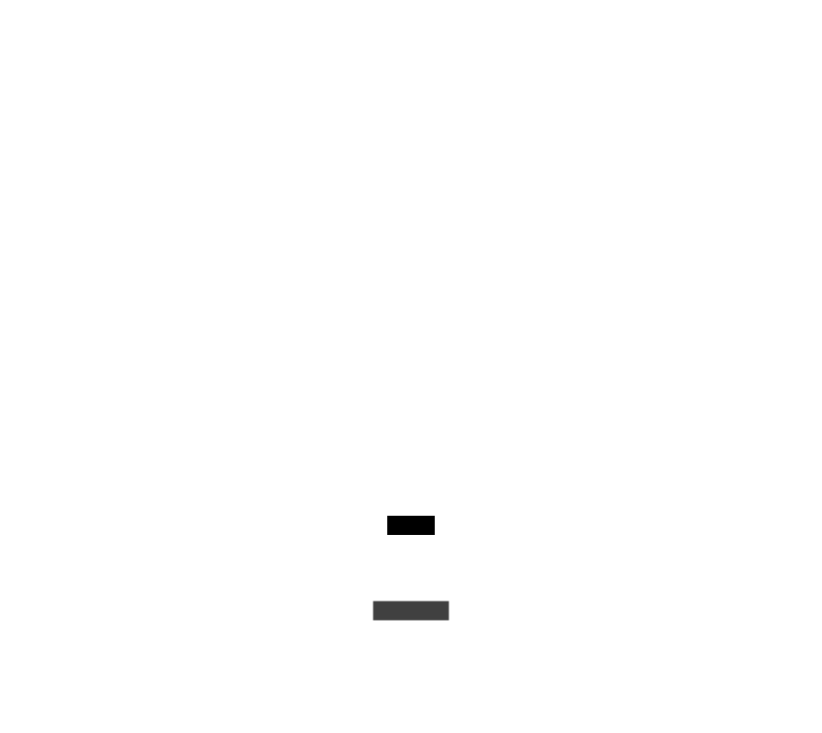

# Les organismes de la scène : Niveau du jeu - Element de jeu - Carte

Les organismes de la scène Niveau du jeu élément de jeu carte sont les éléments qui gère l'affichage de la carte.

### models/gameLevel/game/map/GameMap.lua

Le composant GameMap est l'élément qui affiche la carte.

### models/gameLevel/game/map/FogOfWar.lua

Le composant FogOfWar est l'élément qui affiche le brouillard de guerre.

### models/gameLevel/game/map/PathFinding.lua

Le composant PathFinding est l'élément qui permet de calculer le déplacement des unités.

