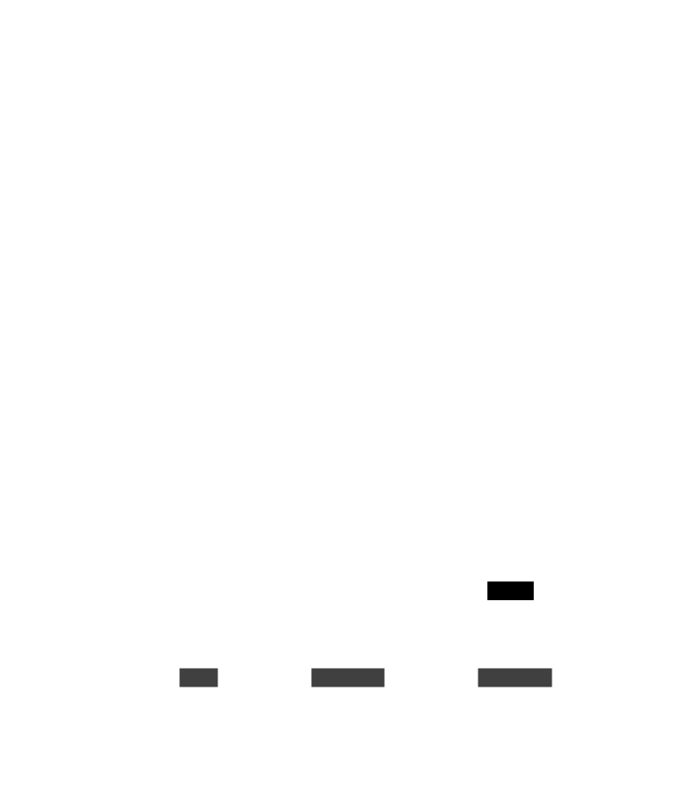
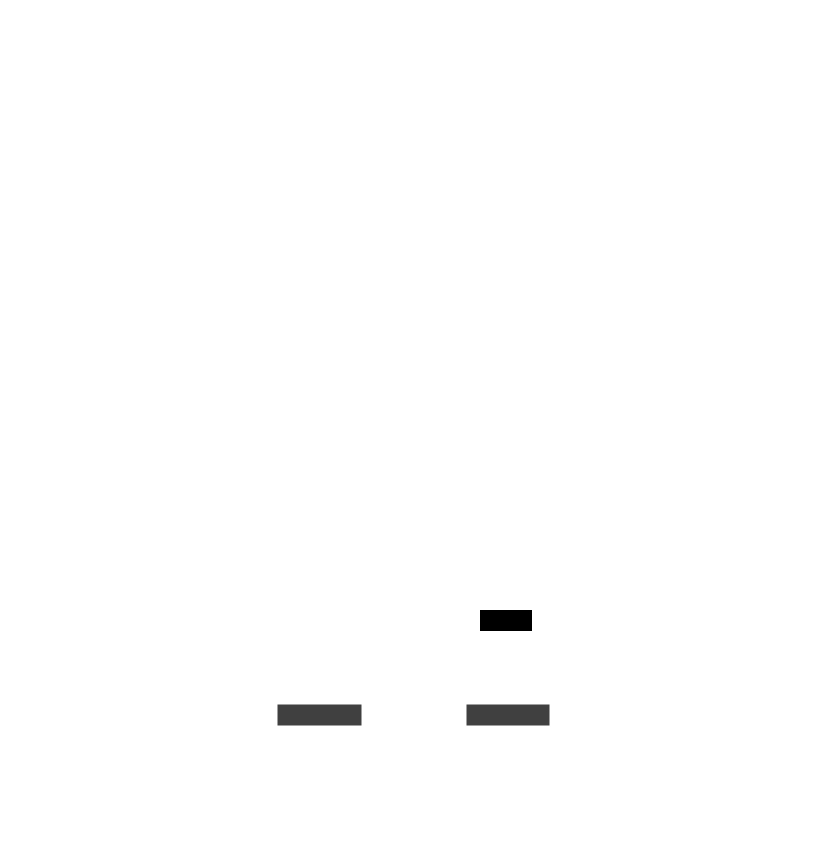

# Les organismes de la scene : Niveau du jeu - Notifications

Les organismes de la scene Niveau du jeu notifications regroupent les organismes qui permettent d'afficher au joueur les
notifications en jeu.

### models/gameLevel/notifications/Notification.lua

Le composant Notification représente une notification en jeu.

### models/gameLevel/notifications/GameNotification.lua

Le composant GameNotification est le composant qui affiche les notifications en jeu.

