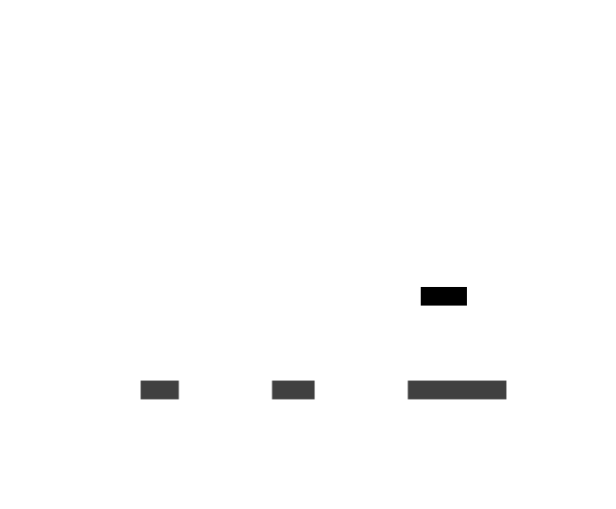
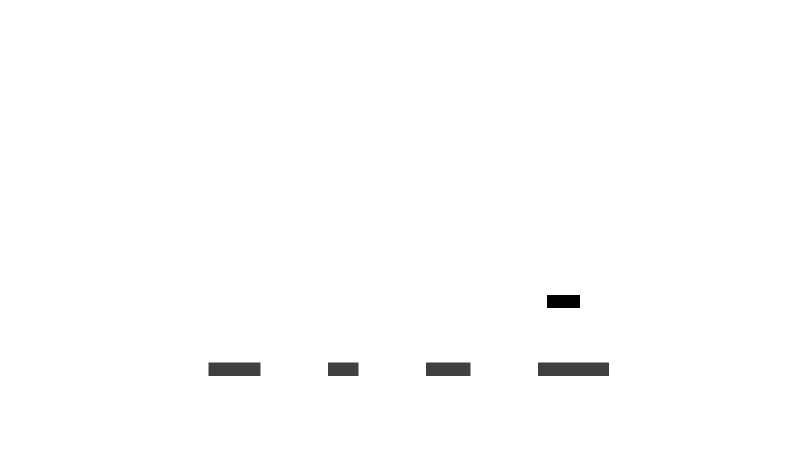

# Les organismes de la scene : Niveau du jeu - Pause

Les organismes de la scene Niveau du jeu pause regroupent les organismes qui seront utilisés pour gérer la pause du jeu.

### models/gameLevel/pause/HelpFrame.lua

Le composant HelpFrame affiche l'écran indiquant le but du jeu au démarrage d'un niveau.

### models/gameLevel/pause/PauseMenuFrame.lua

Le composant PauseMenuFrame affiche le menu de pause du jeu.

