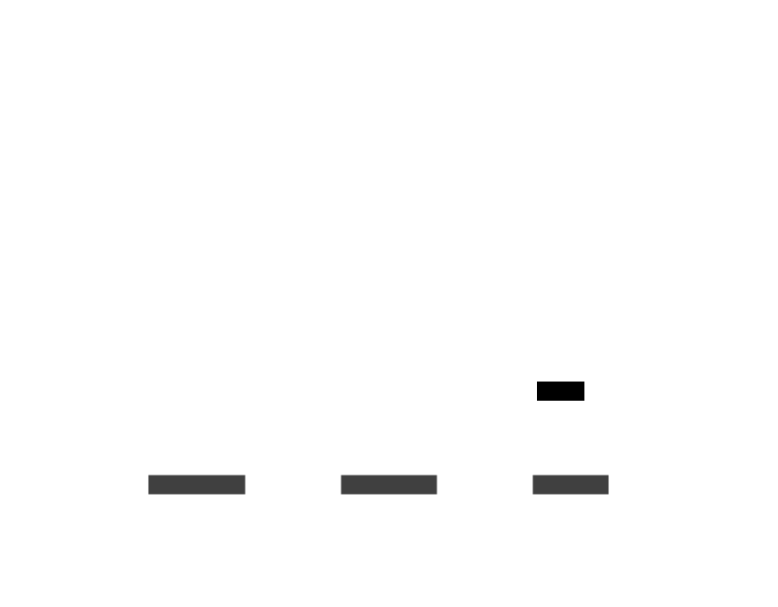
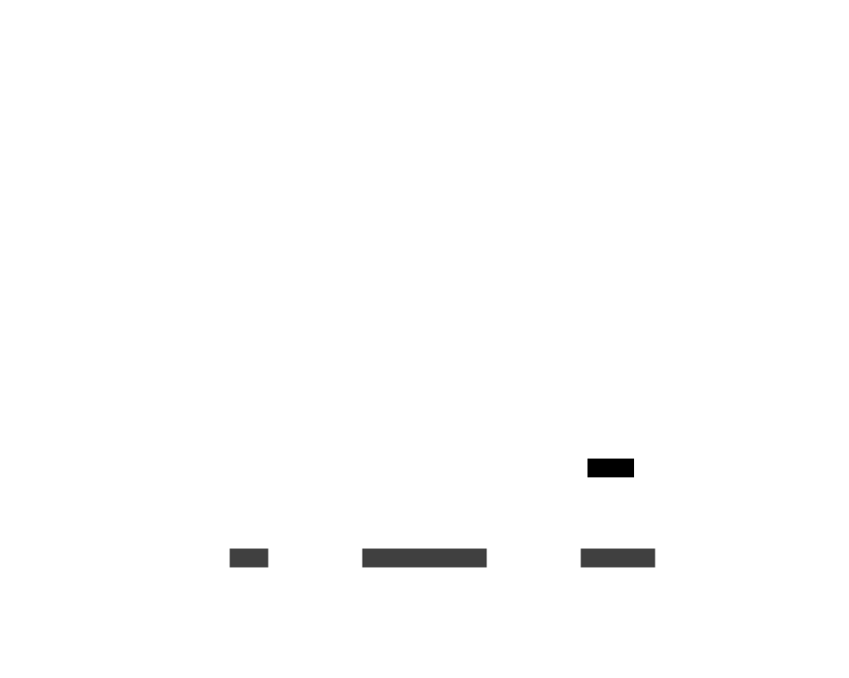
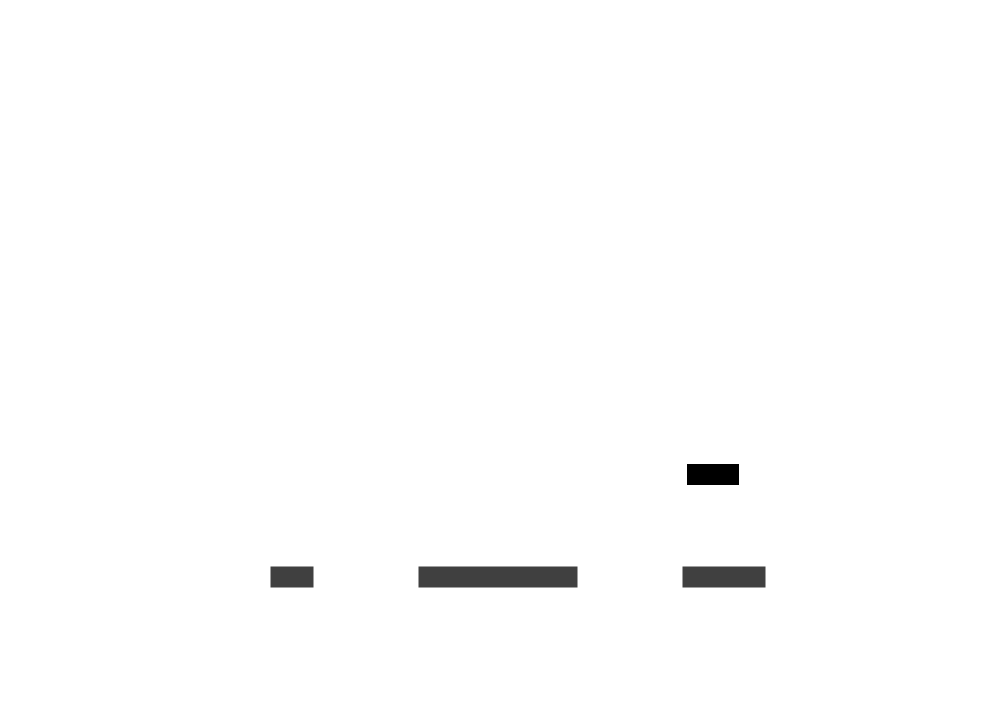
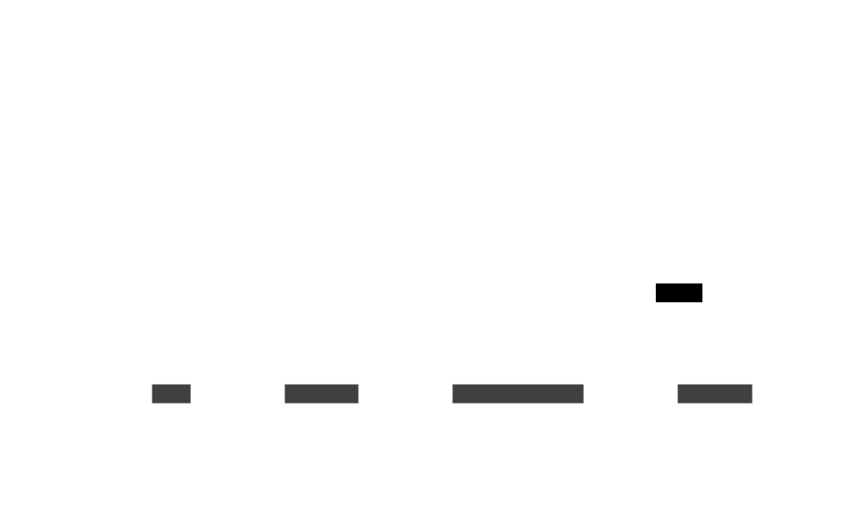
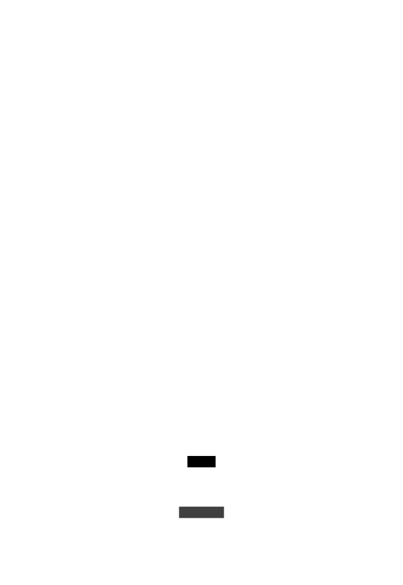
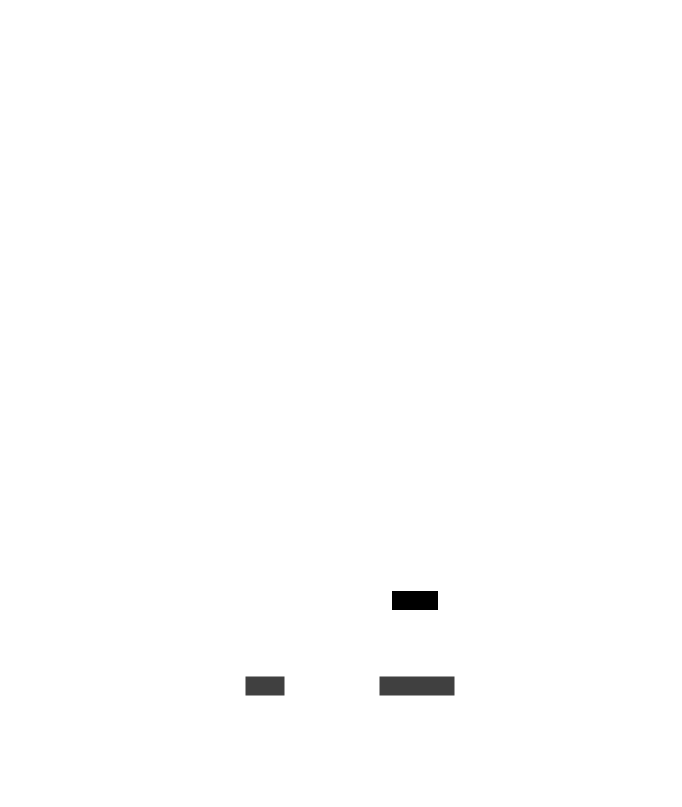

# Les organismes de la scene : Niveau du jeu - Interface utilisateur

Les organismes de la scene Niveau du jeu interface utilisateur regroupent les organismes qui seront utilisés pour
afficher l'interface utilisateur du jeu.

### models/gameLevel/ui/UIManager.lua

Le composant UIManager affiche gère l'affichage des éléments de l'interface utilisateur en cours de jeu.

### models/gameLevel/ui/TowerStatusUI.lua

Le composant TowerStatusUI affiche le statut des tours en haut de l'écran.

### models/gameLevel/ui/TowerStatusItemUI.lua

Le composant TowerStatusItemUI affiche le statut d'une tour en haut de l'écran.

### models/gameLevel/ui/TowerStatusHeathBar.lua

Le composant TowerStatusHeathBar affiche le barre de vie d'une tour en haut de l'écran.

### models/gameLevel/ui/PlayerStatusUI.lua

Le composant PlayerStatusUI affiche les informations sur les tours principales en haut de l'écran (joueur ou enemi).

### models/gameLevel/ui/MainTowerHeathBar.lua

Le composant MainTowerHeathBar affiche la barre de vie des tours principales en haut de l'écran (joueur ou enemi).

### models/gameLevel/ui/EndGameUI.lua

Le composant EndGameUI affiche au joueur le message victoire ou defaite.

