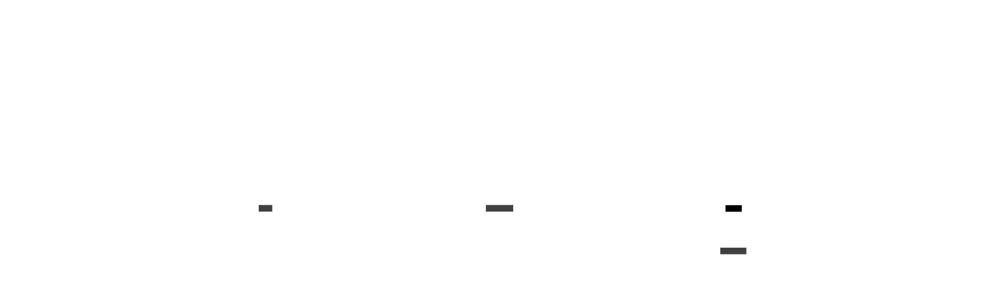
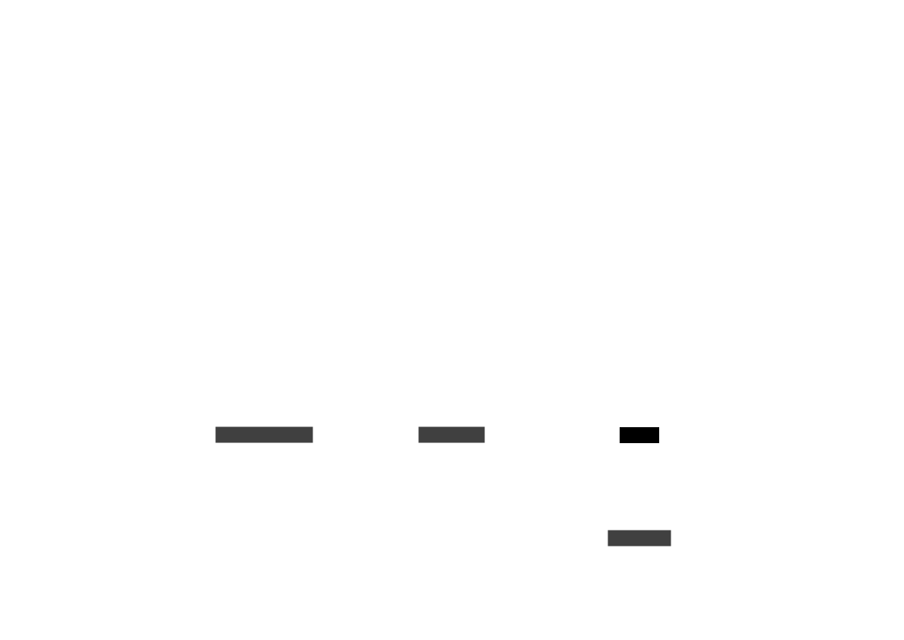
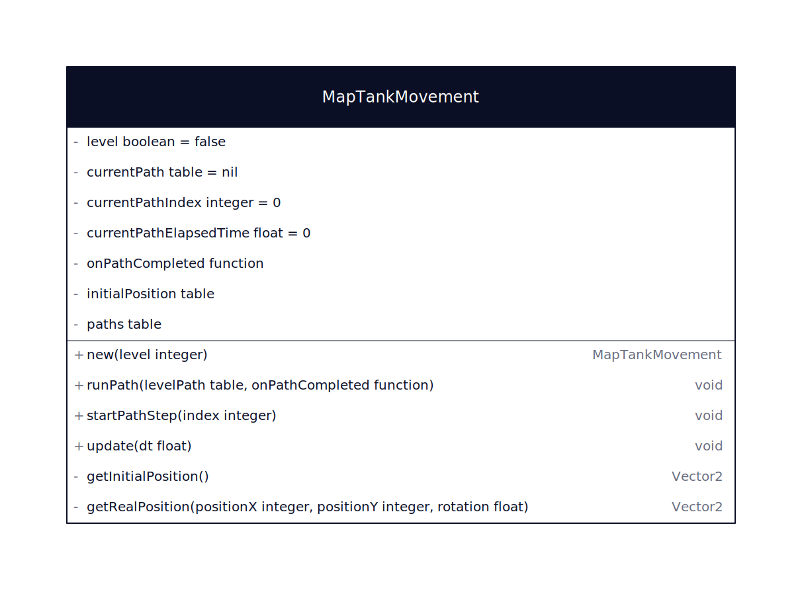

# Les organismes de la scène : Selection de niveau

Les organismes de la scène Selection de niveau sont les organismes qui composent la scène de selection du niveau de jeu.

### models/levelselect/InformationFrame.lua

Le composant InformationFrame est l'écran qui affiche les informations du niveau au survol de la souris

### models/levelselect/LevelButton.lua

Le composant LevelButton est le bouton qui permet de sélectionner un niveau

### models/levelselect/MapTank.lua

Le composant MapTank est le composant qui affiche le tank sur la map

### models/levelselect/MapTankMovement.lua

La class MapTankMovement est la classe qui contient les paramètres de déplacement du tank sur la carte

