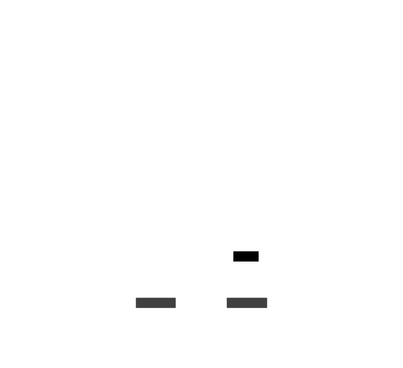
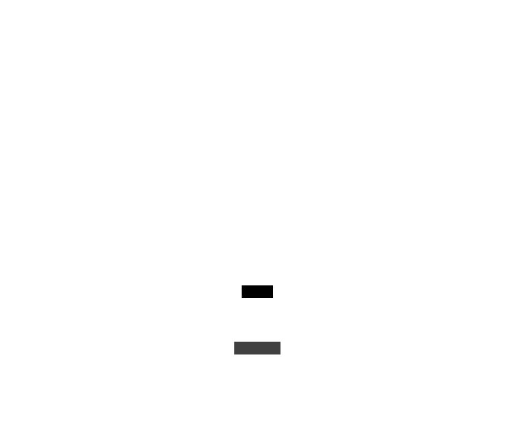

# Les organismes de la scène : Niveau du jeu - Débogage

Les organismes de la scène Niveau du jeu débogage sont l'ensemble des organismes qui permettent de debugger la scène
de Niveau du jeu.

### models/gameLevel/debug/DebugItem.lua

Le composant DebugItem est le composant de base de chaque composant de débogage de la scène de Niveau du jeu.

### models/gameLevel/debug/DebugManager.lua

Le composant DebugManager gère la collection d'elements de débogage de la scène de niveau de jeu.

### models/gameLevel/debug/FpsDebug.lua

Le composant FpsDebug permet d'afficher les fps du jeu en cours.

### models/gameLevel/debug/GameMapDebug.lua

Le composant GameMapDebug permet d'afficher les informations de débogage de la carte (nombre de cellules affichées,
etc.)

### models/gameLevel/debug/GameMapTilesDebug.lua

Le composant GameMapTilesDebug permet d'afficher les informations de débogage de la carte (index des tuiles, etc.)

### models/gameLevel/debug/PathFindingDebug.lua

Le composant PathFindingDebug permet d'afficher a l'écran les informations de débogage du pathfinding.

### models/gameLevel/debug/UnitsColliderDebug.lua

Le composant UnitsColliderDebug permet d'afficher a l'écran les informations de collision des elements du jeu.

### models/gameLevel/debug/ViewPortDebug.lua

Le composant ViewPortDebug permet d'afficher a l'écran les informations sur le viewport de la scène (position de la
camera, etc.)

