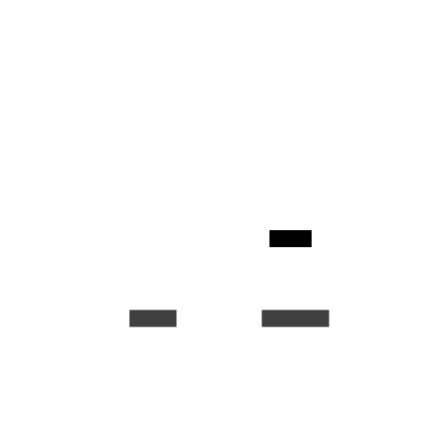

# Les organismes de la scène : Menu principal

Les organismes de la scène Menu principal sont les organismes qui composent la scène du menu principal du jeu.

### models/mainmenu/ConfirmationFrame.lua

Le composant ConfirmationFrame est l'écran de confirmation affichée lorsque l'utilisateur souhaites quitter le jeu

### models/mainmenu/CreditsFrame.lua

Le composant CreditsFrame est l'écran qui s'affiche pour indiquer les crédits du jeu

### models/mainmenu/MainMenuFrame.lua

Le composant MainMenuFrame est la frame qui contient le menu principal du jeu

### models/mainmenu/MainMenuParallax.lua

Le composant MainMenuParallax permet d'afficher l'ensemble des parallax de la scène du menu principal

### models/mainmenu/ParametersFrame.lua

Le composant ParametersFrame est l'écran qui s'affiche pour afficher les paramètres du jeu

