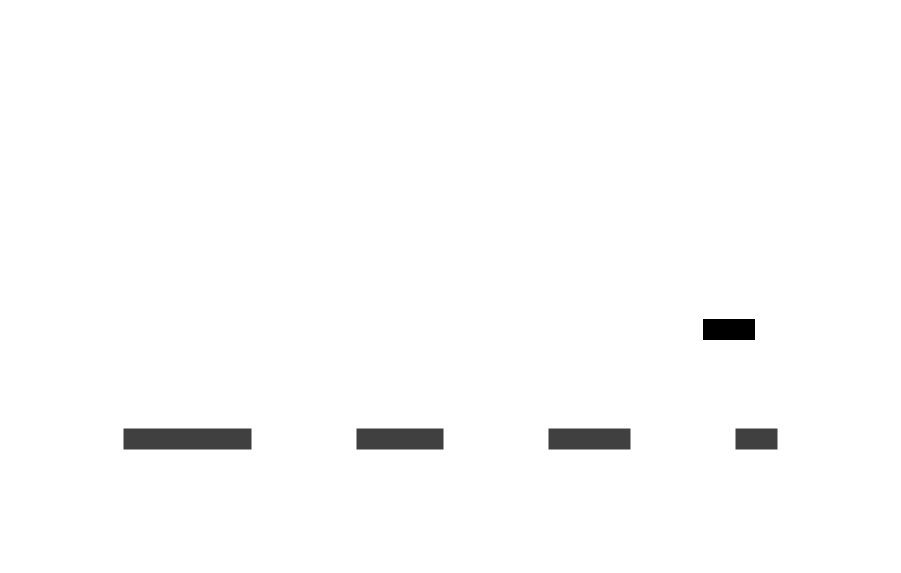
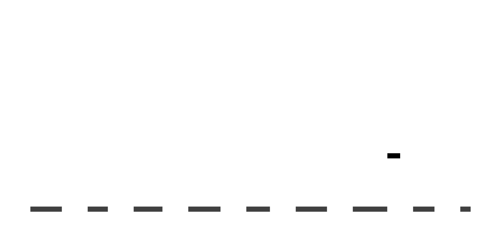
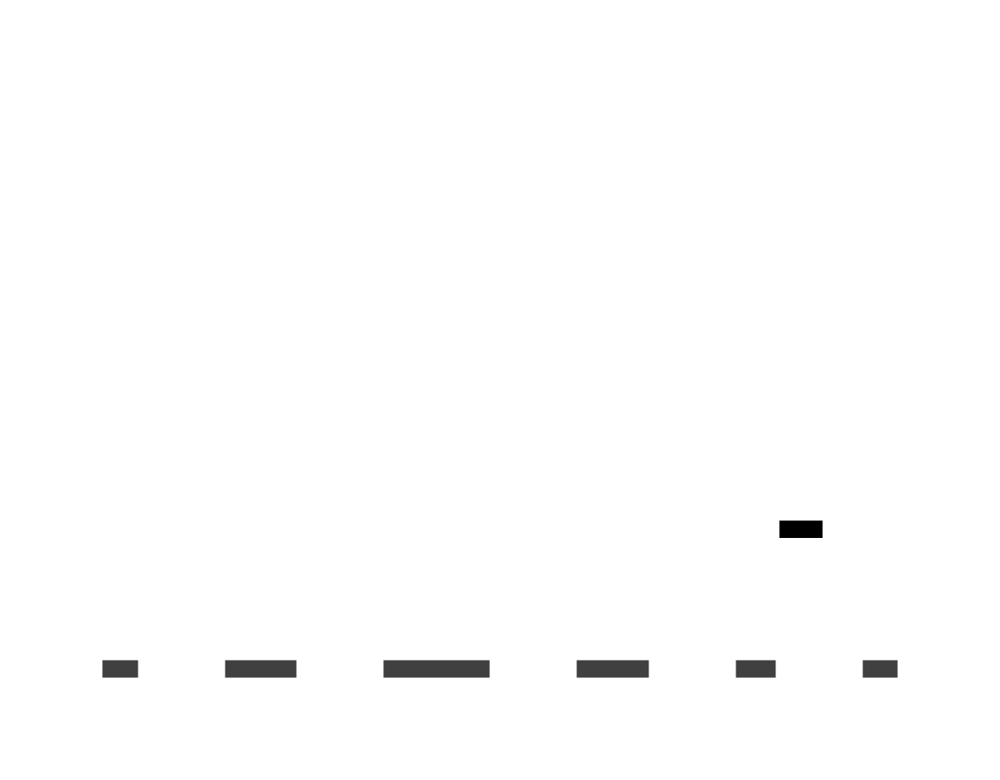
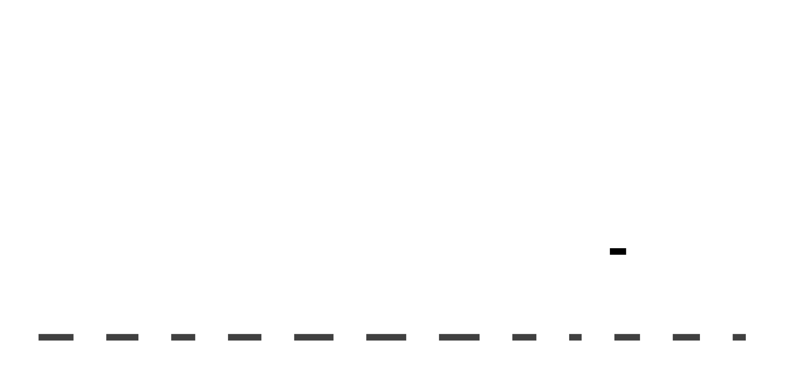

# Les templates/scènes du jeu

Les templates/scènes sont des composants plus complexes qui contiennent des organismes, des molécules et des atomes il
représente les scènes du jeu

### scenes/SplashScreen.lua

Le composant SplashScreen affiche la scène de démarrage du jeu.

### scenes/MainMenu.lua

Le composant MainMenu affiche le menu principal du jeu.

### scenes/LevelSelect.lua

Le composant LevelSelect affiche l'écran de selection de niveau.

### scenes/GameLevel.lua

Le composant GameLevel affiche la partie du jeu.

