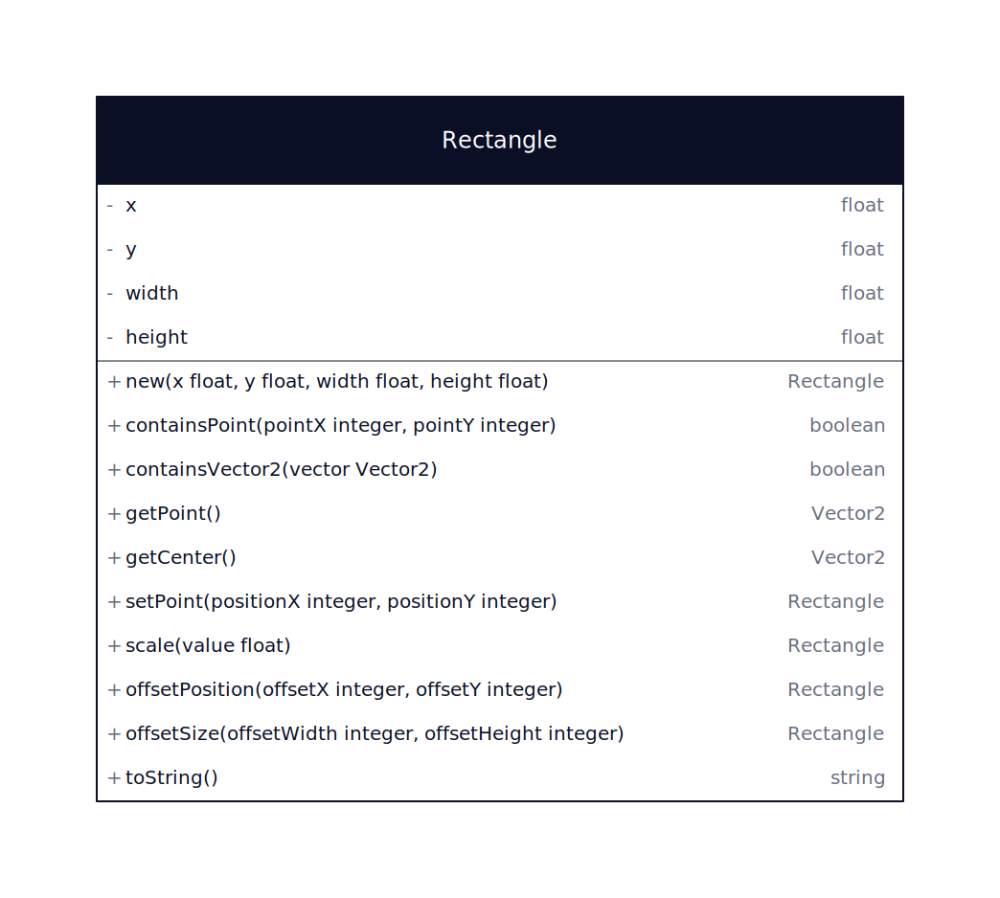
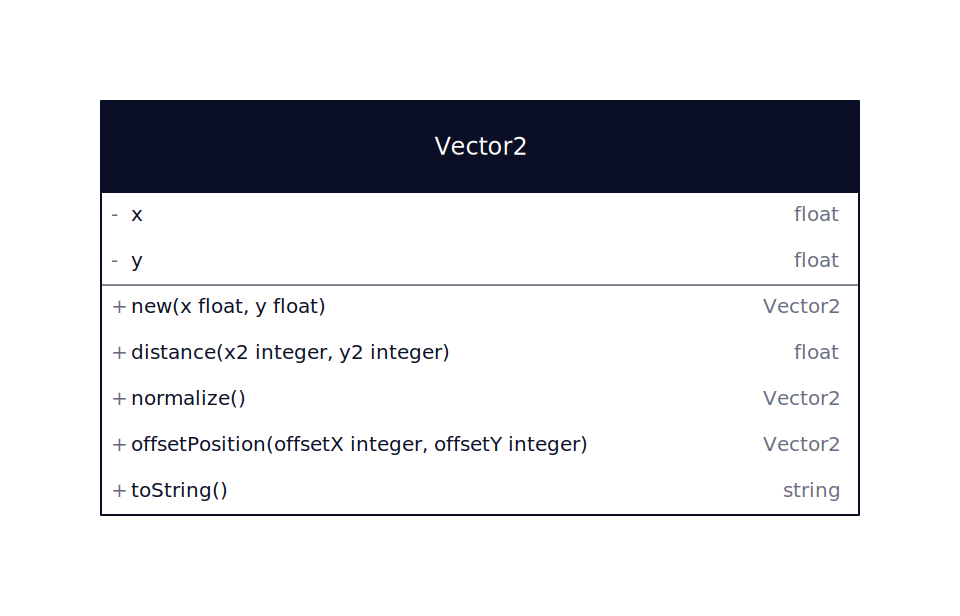

# Les classes utilitaires

Les classes utilitaires sont des classes qui apportent des fonctionnalités partagées par les composants du framework

### framework/drawing/Rectangle.lua

La classe Rectangle est utilisée par les composants pour définir la zone de dessin ou de collision

### framework/drawing/Vector2.lua

La classe Vector2 est utilisée par les composants pour définir une position ou un point de la carte

### framework/tools/JsonAsset.lua

La classe JsonAsset permet de charger un fichier json et de le parser en objet lua

### framework/tools/MathHelper.lua

La classe MathHelper contient des méthodes statiques pour effectuer des opérations mathématiques

### framework/tools/Tables.lua

La classe Tables contient des méthodes statiques pour effectuer des opérations sur les tables

